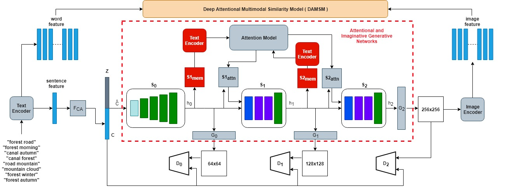
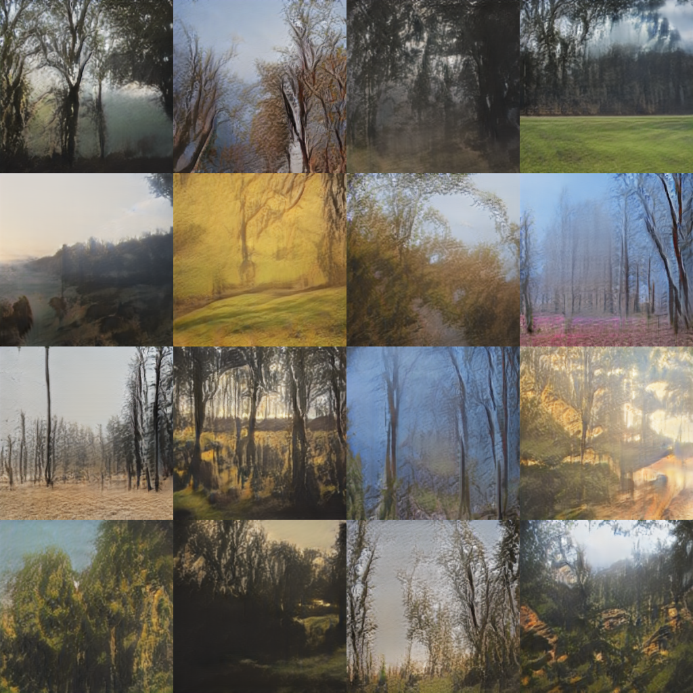
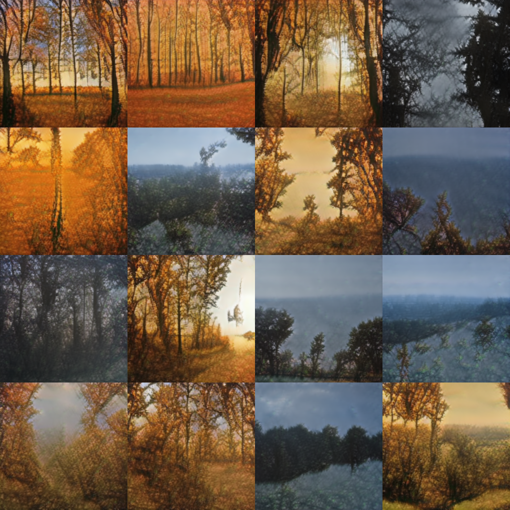

# SceneGAN

Pytorch implementation for scene generation with place and time descriptions.(This is first experiment stage to create a story generator)
This project is based on [AttnGAN: Fine-Grained Text to Image Generation with Attentional Generative Adversarial Networks](http://openaccess.thecvf.com/content_cvpr_2018/papers/Xu_AttnGAN_Fine-Grained_Text_CVPR_2018_paper.pdf) by Tao Xu, Pengchuan Zhang, Qiuyuan Huang, Han Zhang, Zhe Gan, Xiaolei Huang, Xiaodong He. (This work was performed when Tao was an intern with Microsoft Research). 

AttnGAN Architecture

SceneGAN Architecture

## Target and Difference with AttnGAN

* Target: Our final goal is want to train a story generator with descriptions, so we want to **increase the diversity** of our generator. And then, we can create a lot of different story images.
* Difference: We add a **imagination mechanism** to increase our diversity of generator.

## Dependencies
python 3.5

Pytorch 1.0.1post2

In addition, please add the project folder to PYTHONPATH and `pip install` or `pip install -r requirements` the following packages:
- `torchvision`
- `python-dateutil`
- `easydict`
- `pandas`
- `torchfile`
- `nltk`
- `scikit-image`

## Data
1. We use the part of Google OpenImage V4 Dataset and part of Places365 Datasets.
2. In this project, we didn't provide the dataset.
3. We only provide the weight of SceneGAN.(On following google cloud place)

## Pretrained Model

- [DAMSM for sceneGAN](https://drive.google.com/drive/folders/1wysJ2v7wLatIRJ5FsIa2oJ6Ov17thRrL?usp=sharing). Download and save it to `./DAMSMencoders/`
- [SceneGAN](https://drive.google.com/drive/folders/1fx6L7D1rHSXzhbFNpoPMq6or_9mLYSxw?usp=sharing). Download and save it to `./models/`

## Sampling
1. Run python `python preprocess.py` to produce the description files.
2. Download the pretrained models.
3. Run `python main.py --cfg cfg/eval_scene.yml --gpu 0` to generate examples from descriptions in files listed in `./data/OpenImage/example_filenames.txt`. Results are saved to `models/netG_epoch45`. 
- Input your own sentence in `./data/OpenImage/example_captions.txt` if you wannt to generate images from customized sentences.(description is listed with 16 batch size)
- `*.yml` files are example configuration files for training/evaluation our models.

## Compare to Imagination and No Imagination

### Description: **Forest Morning**

* **Imagination Mechanism**

* **No Imgination Mechansim**

* You can see other example from assets directory.
* Not all generated images are perfect.

## Reference

- [AttnGAN: Fine-Grained Text to Image Generation
with Attentional Generative Adversarial Networks](http://openaccess.thecvf.com/content_cvpr_2018/papers/Xu_AttnGAN_Fine-Grained_Text_CVPR_2018_paper.pdf) [[code]](https://github.com/taoxugit/AttnGAN)